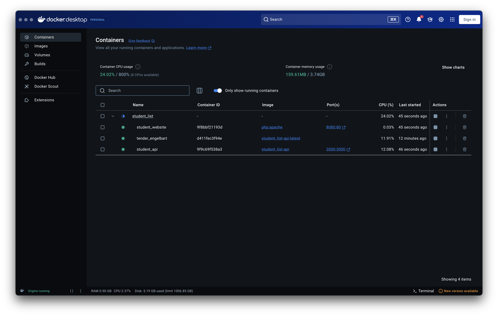

### Réalisé par :
- **Ali Harit**
- **Anas Zerhoun**
- **Mohamed Amine Moutaouakil**

Développement et Déploiement d'un Système de Gestion des Âges des Étudiants avec Docker et Flask API

# 1. Introduction

## 1.1 Objectif du Projet

Ce projet vise à développer et déployer un Système de Gestion des Âges des Étudiants en utilisant Flask API, PHP, et Docker. Le système permet aux utilisateurs de récupérer les données d'âge des étudiants via une API et de les afficher sur une interface web.

## 1.2 Technologies Utilisées

Flask (Python) - Pour la création de l'API RESTful.

PHP - Pour l'interface web.

Docker - Pour la conteneurisation et le déploiement.

Docker Compose - Pour gérer les services multi-conteneurs.

## 1.3 Aperçu du Déploiement

L'application est déployée à l'aide de Docker, où les applications Flask et PHP s'exécutent dans des conteneurs séparés et communiquent via un réseau en pont Docker.

## 2. Architecture du Système

### 2.1 Aperçu

Le système suit une architecture client-serveur :

- Le **frontend PHP** envoie des requêtes à l'**API Flask**.
- L'**API Flask** récupère les données d'âge des étudiants à partir d'un fichier JSON.
- Les deux services s'exécutent dans des **conteneurs Docker** et communiquent via un réseau partagé.

### 2.2 Composants

#### **API Flask (student_age.py)**

- Gère les requêtes de données d'âge des étudiants.
- Utilise une authentification basique.
- Lit et écrit les données dans le fichier **student_age.json**.

#### **Interface Web PHP (index.php)**

- Récupère les données de l'API Flask via une requête HTTP GET.
- Utilise l'authentification pour accéder aux endpoints sécurisés.
- Affiche dynamiquement les données d'âge des étudiants.

#### **Configuration Docker**

- **Dockerfile** : Définit le conteneur de l'API Flask.
- **docker-compose.yml** : Configure et exécute les deux services ensemble.


# API Flask - Gestion des Âges des Étudiants

Cette API REST, développée avec **Flask**, permet de récupérer les âges des étudiants avec une authentification basique.

## Fonctionnalités

- **Authentification basique** : Nom d'utilisateur `root` et mot de passe `root`.
- **Endpoints** :
  - **`GET /supmit/api/v1.0/get_student_ages`** : Récupère l'âge de tous les étudiants.
  - **`GET /supmit/api/v1.0/get_student_ages/<student_name>`** : Récupère l'âge d'un étudiant spécifique.
  
## Explication du Code

1. **Authentification** : Utilisation de `HTTPBasicAuth` pour sécuriser les routes.
2. **Chargement des données** : Les âges des étudiants sont stockés dans un fichier JSON `student_age.json`, chargé à l'initialisation.
3. **Gestion des erreurs** : 
   - **404** pour une ressource non trouvée.
   - **401** pour une authentification échouée.
4. **Routes** :
   - `get_student_ages()` : Retourne l'ensemble des âges.
   - `get_student_age()` : Retourne l'âge d'un étudiant spécifique ou une erreur si non trouvé.


## Exemple de Requête

```bash
http://localhost:3000/supmit/api/v1.0/get_student_ages
http://localhost:3000/supmit/api/v1.0/get_student_ages/ali
```
# Dockerfile - Configuration du Conteneur
```Dockerfile
FROM python:3.8-buster

LABEL maintainer="Ali Harit <ali.harit@usms.ac.ma>"

RUN apt-get update && apt-get install -y libldap2-dev libsasl2-dev python3-dev

WORKDIR /

COPY student_age.py /
COPY student_age.json /data/student_age.json
COPY requirements.txt /

RUN pip3 install -r /requirements.txt

VOLUME /data

EXPOSE 3000

CMD ["python3", "./student_age.py"]

```
Ce fichier **Dockerfile** définit l'image Docker pour l'API Flask. Il configure l'environnement nécessaire et exécute l'API dans un conteneur.

## Explication du Dockerfile

1. **Base Image** :
   ```dockerfile
   FROM python:3.8-buster
   ```
   Utilise l'image officielle Python 3.8 basée sur Debian Buster.

2. **Mainteneur** :
   ```dockerfile
   LABEL maintainer="Ali Harit <ali.harit@usms.ac.ma>"
   ```
   Définit le mainteneur de l'image Docker.

3. **Installation des Dépendances Système** :
   ```dockerfile
   RUN apt-get update && apt-get install -y libldap2-dev libsasl2-dev python3-dev
   ```
   Installe les bibliothèques nécessaires pour le fonctionnement de certaines dépendances Python (LDAP, SASL, etc.).

4. **Répertoire de Travail** :
   ```dockerfile
   WORKDIR /
   ```
   Définit le répertoire de travail pour les commandes suivantes dans le conteneur.

5. **Copie des Fichiers** :
   ```dockerfile
   COPY student_age.py /
   COPY student_age.json /data/student_age.json
   COPY requirements.txt /
   ```
   Copie les fichiers nécessaires dans l'image Docker :
   - `student_age.py` : le fichier principal de l'API.
   - `student_age.json` : fichier de données des étudiants.
   - `requirements.txt` : fichier contenant les dépendances Python.

6. **Installation des Dépendances Python** :
   ```dockerfile
   RUN pip3 install -r /requirements.txt
   ```
   Installe les bibliothèques Python spécifiées dans le fichier `requirements.txt`.

7. **Volume Docker** :
   ```dockerfile
   VOLUME /data
   ```
   Crée un volume Docker pour stocker les données, permettant une persistance et un partage de données entre le conteneur et l'hôte.

8. **Exposition du Port** :
   ```dockerfile
   EXPOSE 3000
   ```
   Expose le port 3000 pour accéder à l'application Flask.

9. **Commande de Démarrage** :
   ```dockerfile
   CMD ["python3", "./student_age.py"]
   ```
   Définit la commande à exécuter au démarrage du conteneur pour lancer l'API Flask.


# Student Checking App - Interface Web
```php
<html>

<head>
    <title>SUPMIT</title>
</head>

<body>
    <h1>Student Checking App</h1>
    <form action="" method="POST">
        <button type="submit" name="submit">List Student</button>
    </form>

    <?php
    if ($_SERVER['REQUEST_METHOD'] == "POST" && isset($_POST['submit'])) {
        // Use environment variables or default credentials
        $username = $_ENV['USERNAME'] ?? 'root';
        $password = $_ENV['PASSWORD'] ?? 'root';

        $context = stream_context_create([
            "http" => [
                "header" => "Authorization: Basic " . base64_encode("$username:$password"),
                "timeout" => 5 // Timeout to prevent hanging
            ]
        ]);

        $url = 'http://student_api:3000/supmit/api/v1.0/get_student_ages';
        $response = file_get_contents($url, false, $context);

        if ($response === FALSE) {
            echo "<p style='color:red;'>Failed to retrieve student data. API might be down.</p>";
        } else {
            $list = json_decode($response, true);
            echo "<p style='color:red; font-size: 20px;'>This is the list of students with their ages:</p>";
            foreach ($list["student_ages"] as $key => $value) {
                echo "- <b>$key</b> is <b>$value</b> years old <br>";
            }
        }
    }
    ?>
</body>

</html>
```
Cette application Web simple permet d'afficher une liste des étudiants avec leurs âges, en interrogeant l'API Flask via une requête HTTP.

## Fonctionnalités

- Affiche la liste des étudiants et leurs âges en interrogeant l'API Flask.
- Utilise l'authentification basique pour sécuriser l'accès à l'API.

## Explication du Code

1. **Formulaire de soumission** :
   ```html
   <form action="" method="POST">
       <button type="submit" name="submit">List Student</button>
   </form>
   ```
   - Un formulaire avec un bouton permet d'envoyer une requête `POST` pour obtenir la liste des étudiants.

2. **Authentification Basique** :
   - Le nom d'utilisateur et le mot de passe sont récupérés à partir des variables d'environnement (`$_ENV['USERNAME']` et `$_ENV['PASSWORD']`), avec des valeurs par défaut (`root`).
   - L'en-tête HTTP `Authorization` est utilisé pour envoyer ces informations sous forme codée en base64.

3. **Envoi de la requête à l'API Flask** :
   ```php
   $url = 'http://student_api:3000/supmit/api/v1.0/get_student_ages';
   $response = file_get_contents($url, false, $context);
   ```
   - La requête `GET` est envoyée à l'API Flask à l'URL spécifiée, qui doit être accessible via le réseau interne Docker (ici, le nom `student_api` est utilisé).
   - L'authentification est incluse dans les en-têtes HTTP avec un timeout de 5 secondes pour éviter les blocages.

4. **Affichage des résultats** :
   - Si la requête réussit, la réponse JSON est décodée et chaque étudiant et son âge est affiché.
   - En cas d'échec (par exemple, si l'API est inaccessible), un message d'erreur est affiché.


# Docker Compose - Déploiement de l'API et Interface de Registre
```dockerfile
version: '3.8'

services:
  registry:
    image: registry:2
    container_name: registry
    ports:
      - "3000:3000"

  registry-ui:
    image: joxit/docker-registry-ui
    container_name: registry_ui
    environment:
      - REGISTRY_URL=http://registry:3000
    ports:
      - "8081:80"
    depends_on:
      - registry


```
Ce fichier **docker-compose-registry.yml** configure deux services principaux : un registre Docker privé et une interface utilisateur pour visualiser et gérer le registre.

## Services

### 1. **registry** : Registre Docker privé

- **Image** : Utilise l'image officielle `registry:2`.
- **Port** : Expose le port 3000 pour accéder au registre.
- **Container Name** : Nommé `registry`.

### 2. **registry-ui** : Interface utilisateur pour le registre

- **Image** : Utilise l'image `joxit/docker-registry-ui` pour fournir une interface graphique pour le registre Docker.
- **Environnement** : Configure l'URL du registre avec la variable `REGISTRY_URL=http://registry:3000`.
- **Port** : Expose l'interface sur le port 8081.
- **Dépendance** : Dépend du service `registry` pour garantir que le registre est lancé avant l'interface.

## Configuration

Le fichier `docker-compose.yml` définit deux services :

1. **`registry`** : Le service qui exécute le registre Docker.
2. **`registry-ui`** : Le service qui exécute l'interface graphique pour le registre Docker.

Lorsque vous démarrez le service via Docker Compose, l'interface graphique sera disponible sur `http://localhost:8081` et vous permettra de gérer votre registre Docker privé accessible à `http://localhost:3000`.

# Docker Compose - Déploiement de l'API et de l'Interface Web
```dockerfile
services:
  api:
    build: ./simple_api
    container_name: student_api
    ports:
      - "3000:3000"
    volumes:
      - /Users/its.aliiiiiiii/Downloads/student_list/simple_api/student_age.json:/data/student_age.json
    networks:
      - student_network

  website:
    image: php:apache
    container_name: student_website
    ports:
      - "8080:80"
    volumes:
      - ./website:/var/www/html
    depends_on:
      - api
    networks:
      - student_network

networks:
  student_network:
    driver: bridge

```
Ce fichier **docker-compose.yml** définit et orchestre deux services principaux : une API Flask qui fournit des données d'étudiants et une interface Web PHP pour afficher ces données.

## Services

### 1. **api** : Service API Flask

- **Image/Build** : Le service `api` est construit à partir du dossier `./simple_api` contenant le code source de l'API Flask.
- **Container Name** : Nommé `student_api`.
- **Port** : Le port 3000 est exposé pour permettre l'accès à l'API Flask.
- **Volumes** : Le fichier `student_age.json` est monté depuis l'hôte (chemin local) vers `/data/student_age.json` dans le conteneur pour la gestion des données des étudiants.
- **Networks** : Le service `api` est connecté au réseau interne `student_network`.

### 2. **website** : Service Interface Web PHP

- **Image** : Utilise l'image `php:apache` pour exécuter un serveur web Apache avec PHP.
- **Container Name** : Nommé `student_website`.
- **Port** : Le port 8080 est exposé pour accéder à l'interface web sur `http://localhost:8080`.
- **Volumes** : Le dossier `./website` sur l'hôte est monté dans le conteneur à l'emplacement `/var/www/html` pour contenir les fichiers du site PHP.
- **Depends On** : Le service `website` dépend du service `api`, garantissant que l'API est démarrée avant le site Web.
- **Networks** : Le service `website` est également connecté au réseau interne `student_network`.


La commande docker-compose up --build -d 

--build : Reconstruit les images avant de démarrer les conteneurs (utile si vous avez modifié le code ou le Dockerfile).

-d : Démarre les services en arrière-plan (mode détaché).


La commande docker ps est utilisée pour lister les conteneurs Docker en cours d'exécution. Elle affiche des informations sur les conteneurs actifs, telles que leur ID, nom, statut, ports exposés, et plus encore.


La commande docker logs permet de visualiser les journaux (logs) d'un conteneur Docker en particulier. Si vous souhaitez voir les logs d'un conteneur nommé student_list, vous pouvez





# Partie 2


``` dockerfile
FROM nginx:alpine
```
une image Docker légère basée sur NGINX + Alpine Linux pour servir un site web statique.

```Jenkinsfile
pipeline {
    agent any

    environment {
        DOCKER_IMAGE = "itsaliiiiiiii/simple_api"
        VERSION = "latest"
    }

    stages {
        stage('Cloner le projet') {
            steps {
                git 'https://github.com/itsaliiiiiiii/MPDocker.git'
            }
        }

        stage('Construire image Docker') {
            steps {
                script {
                    sh 'docker build -t $DOCKER_IMAGE:$VERSION .'
                }
            }
        }

        stage('Tester image Docker') {
            steps {
                script {
                    sh 'docker run -d --name test-container -p 8080:80 $DOCKER_IMAGE:$VERSION'
                    sh 'sleep 5' 
                    sh 'curl -I http://localhost:8080' 
                    sh 'docker stop test-container && docker rm test-container'
                }
            }
        }

    }
}

```

1. **Cloner ton projet depuis GitHub**
2. **Construire une image Docker**
3. **Tester cette image en lançant un conteneur temporaire**

---

##  **Détail de chaque section du pipeline**

### ### `pipeline { ... }`
C’est le bloc principal qui contient tout le pipeline.

---

###  `agent any`
Indique que le pipeline peut s’exécuter sur n’importe quel agent Jenkins disponible (machine/esclave).

---

###  `environment { ... }`
Définit des **variables d’environnement** que tu réutilises plus tard :
- `DOCKER_IMAGE = "itsaliiiiiiii/simple_api"` → Nom de ton image Docker
- `VERSION = "latest"` → Tag de version de l’image (ici, "latest")

---

##  **Les stages (étapes)**

---

###  `stage('Cloner le projet')`
- Utilise la commande `git` pour **cloner ton dépôt GitHub** :  
   `https://github.com/itsaliiiiiiii/MPDocker.git`

---

###  `stage('Construire image Docker')`
- Exécute la commande Docker :  
   `docker build -t $DOCKER_IMAGE:$VERSION .`
- Cela construit une image Docker avec le tag `itsaliiiiiiii/simple_api:latest`

---

###  `stage('Tester image Docker')`
- **Lance un conteneur Docker temporaire** depuis l’image que tu viens de construire :
  ```bash
  docker run -d --name test-container -p 8080:80 $DOCKER_IMAGE:$VERSION
  ```
- **Attend 5 secondes** pour laisser le conteneur démarrer.
- **Teste l'API** avec `curl -I http://localhost:8080` → vérifie si le serveur répond.
- **Stoppe et supprime le conteneur** une fois le test terminé :
  ```bash
  docker stop test-container && docker rm test-container
  ```

# Partie 3


